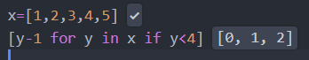
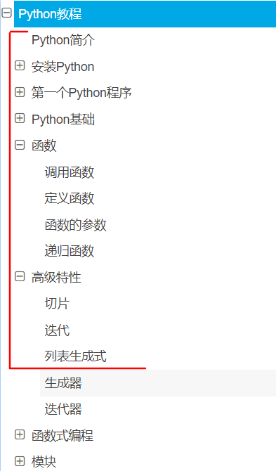
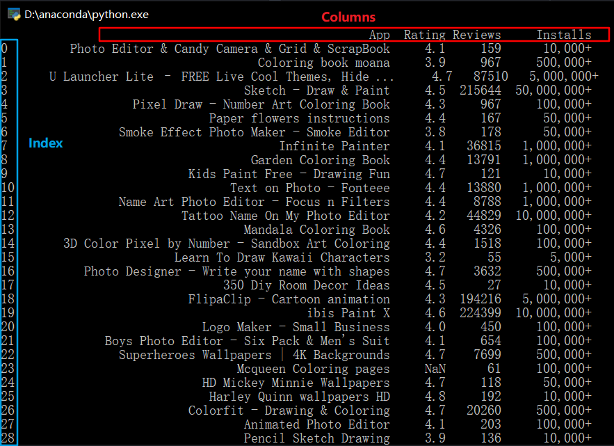

# 数据挖掘小组 第一次活动


## Python 简介

简单对比Python与C/C++:

#### C/C++:
- 更加底层
- 相对更难学一些
- 可以执行地很高效（时间上和空间上）

#### Python：
- 封装层次更高，语法相对更贴近自然语言
- 易上手、易学习
- 执行效率低
- 各种包很多
	- 胶水语言
	- “掉包侠”	
	




C/C++过于底层，实现上会很麻烦；
java更多用于应用、服务程序的开发；
Matlab、R更多用于传统统计、数学模型的计算，环境上也对迁移部署不友好；
Python尤其在数据分析、机器学习模型等方面应用广泛（其他诸如爬虫、web应用开发等方面也用得很多）
所以推荐直接学习使用Python（计科相关专业除外）。


Python学习基本上是两个方面:

1. python本身的基本语法
2. 各类包的使用


对于语法：

仅供参考的语法教程：廖雪峰的教程

https://www.liaoxuefeng.com/wiki/1016959663602400



↑大概看到这里就足够日常使用了（我99%编程时只会用到的部分）


对于包的学习：

没必要全都记住，建议边写边查，边查边写（包括各种CSDN之类的技术文档和官方文档）；

查多了就自然记住了；

有兴趣可以浏览一遍官方函数文档（推荐英文原文的文档）——了解一下都有什么函数；


**因此近几次该系列活动主要目的在于希望能培养大家自主学习使用包的能力**（教是不可能教完的，教完也记不住）


## Pandas包

数据分析最常用的python包之一

有两种常用的数据结构：

- Series：类似于带索引名字的一维数组
- Dataframe：类似于带行名、列名的一张表


### 活动任务：

- 使用pandas读入数据集

- 进行及所需数据部分的选取（选取App、Rating、Reviews、Installs四个列)
- 进行缺失值（NaN）的处理
  - 直接去掉该条数据
  
- 将Installs转换为数值(浮点数float)类型


#### 使用pandas读入数据集

```python
import pandas as pd

df=pd.read_csv("googleplaystore.csv")

print(df)
```

（csv文件需与py文件在同一目录下，因为这里使用的相对路径而非绝对路径）

*※思考：如果要读入的是xlsx文件而非csv呢？*

#### 进行及所需数据部分的选取（选取App、Rating、Reviews、Installs四个列)

Dataframe的索引：



- 只选取某列：`df['App']`
- 只选取某行:`df[1]`
- 选取多行:`df[2:5]`
- 同时选取：`df.iloc[0,1]`

```python
df_1=df[['App','Rating','Reviews','Installs']]

print(df_1)
```

*※思考：所选结果太多了，想要筛选只查看其中Rating在4.9分以上的一部分呢？*

#### 进行缺失值（NaN）的处理


```python
df_3=df_1.dropna()

print(df_3)
```

*※思考：如果要填充所有NaN为0而不是去掉呢？*

#### 将Installs转换为数值(浮点数float)类型

```python
def process_install(x):
    if x=='Free':
        return 0
    else:
        return float(x[:-1].replace(",",""))

df_3['Installs']=df_3["Installs"].map(process_install)

print(df_3)
```

*※思考：如果改为对Size列进行类似处理呢？（注：Size列有M和K两种单位和’Varies with device‘）*